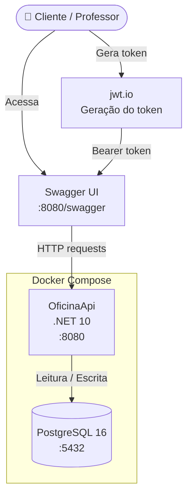
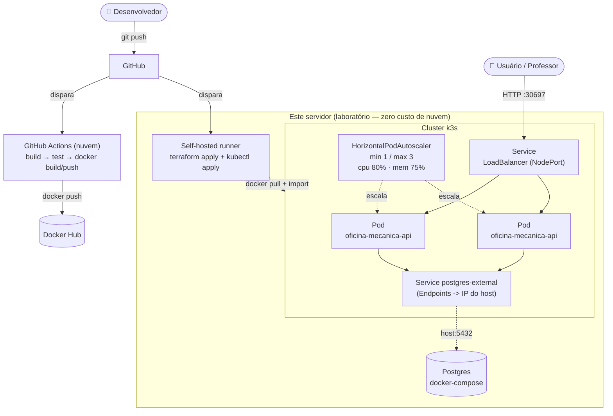
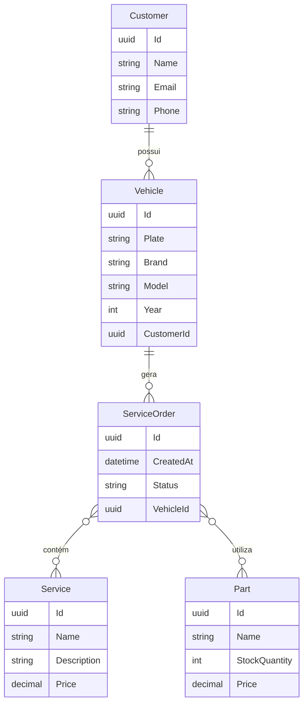
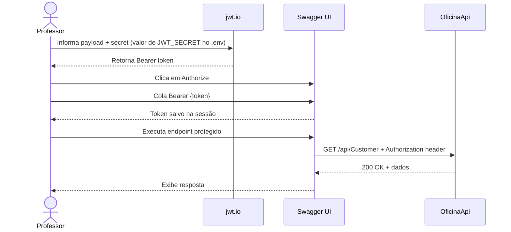
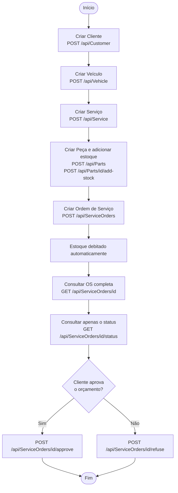

# Oficina Mecânica API

API RESTful para gerenciamento de uma oficina mecânica, desenvolvida com .NET 10, PostgreSQL e Docker.

## Fase 2 — Objetivos desta evolução

Na Fase 1 o sistema cobriu o CRUD básico de clientes, veículos, serviços, peças e ordens de
serviço (OS). Nesta Fase 2, a aplicação evoluiu para suportar maior demanda e disponibilidade:

- **Refatoração** para Clean Architecture (camadas `Domain` / `Application` / `Infrastructure` /
  `Presentation`), com testes automatizados cobrindo os fluxos críticos.
- **Novas regras de negócio na OS**: recusa de orçamento pelo cliente, consulta dedicada de
  status, listagem priorizada por status (Em Execução > Aguardando Aprovação > Diagnóstico >
  Recebida, mais antigas primeiro) e exclusão lógica das OS Finalizadas/Entregues dessa listagem.
- **Notificação por e-mail** a cada mudança de status da OS.
- **Conteinerização** via Docker/Docker Compose para desenvolvimento local.
- **Orquestração via Kubernetes** (Deployment, Service, ConfigMap, Secret, HPA) — veja [Deploy em Kubernetes](#deploy-em-kubernetes).
- **Infraestrutura como código** via Terraform, provisionando o cluster Kubernetes **local (k3s)**
  e conectando-o ao banco do docker-compose — veja [Provisionamento com Terraform](#provisionamento-com-terraform).
- **Pipeline de CI/CD** via GitHub Actions, com um **self-hosted runner** rodando neste mesmo
  servidor para aplicar o Terraform e os manifestos no cluster local — veja [CI/CD](#cicd).

> Por que tudo local? Este servidor é um laboratório de pós-graduação — o desafio permite
> explicitamente cluster "local ou cloud", e local evita qualquer custo de nuvem (AWS, etc.).

---

## Índice

- [Pré-requisitos](#pré-requisitos)
- [Arquitetura](#arquitetura)
- [Modelo de dados](#modelo-de-dados)
- [Fluxo de autenticação](#fluxo-de-autenticação)
- [Fluxo principal — Ordem de Serviço](#fluxo-principal--ordem-de-serviço)
- [Configuração do ambiente](#configuração-do-ambiente)
- [Subindo a aplicação (execução local)](#subindo-a-aplicação-execução-local)
- [Banco de dados e migrations](#banco-de-dados-e-migrations)
- [Deploy em Kubernetes](#deploy-em-kubernetes)
- [Provisionamento com Terraform](#provisionamento-com-terraform)
- [CI/CD](#cicd)
- [Autenticação JWT](#autenticação-jwt)
- [Documentação Swagger](#documentação-swagger)
- [Endpoints disponíveis](#endpoints-disponíveis)
- [Exemplos de requisição](#exemplos-de-requisição)
- [Testes](#testes)
- [Análise de segurança do código](#análise-de-segurança-do-código)
- [Vídeo demonstrativo](#vídeo-demonstrativo)

---

## Pré-requisitos

- [Docker](https://www.docker.com/) e Docker Compose instalados
- Git

---

## Arquitetura

### Arquitetura local (Docker Compose)



### Arquitetura Kubernetes (cluster local — k3s)



Fluxo de deploy: push no `main` → job em nuvem builda, testa e publica a imagem no Docker Hub →
o **self-hosted runner** (rodando neste servidor) roda `terraform apply` (garante o k3s e o
Postgres do docker-compose no ar, e cria o Service `postgres-external` que faz a ponte entre os
dois — ver [Provisionamento com Terraform](#provisionamento-com-terraform)) → aplica os manifestos
de `/k8s` no cluster → o `HorizontalPodAutoscaler` escala os pods conforme o consumo de CPU/memória.
Nenhum recurso é criado em nuvem paga — tudo roda neste servidor.

---

## Modelo de dados



---

## Fluxo de autenticação



---

## Fluxo principal — Ordem de Serviço



---

## Configuração do ambiente

Crie o arquivo `.env` na raiz do projeto com o conteúdo abaixo (credenciais do ambiente de testes):

```env
# Banco de dados
DB_USER=postgres
DB_PASSWORD=@Postech$2026
DB_NAME=oficina_db
DB_CONNECTION_STRING=Host=db;Port=5432;Database=oficina_db;Username=postgres;Password=@Postech$2026

# JWT (mínimo 32 caracteres — chaves curtas são rejeitadas na validação HMAC-SHA256)
JWT_SECRET=<gere um valor aleatorio de 32+ caracteres, ex: openssl rand -base64 32>
JWT_ISSUER=oficina-api
JWT_AUDIENCE=oficina-clientes
```

> O valor de `JWT_SECRET` não é publicado aqui (segredo real não deve ir para o git/README —
> o GitHub bloqueia/alerta automaticamente quando detecta isso). Gere o seu com
> `openssl rand -base64 32` e use o mesmo valor ao gerar o token em jwt.io na seção abaixo.

---

## Subindo a aplicação (execução local)

```bash
# Primeira vez ou após alterações no código
docker compose up --build -d

# Nas próximas vezes (sem alterações de código)
docker compose up -d

# Parar a aplicação
docker compose down
```

Verifique se os containers subiram:

```bash
docker compose ps
```

---

## Banco de dados e migrations

A migration é aplicada automaticamente na primeira vez que a aplicação sobe. Caso precise aplicar manualmente:

```bash
docker compose exec api dotnet ef database update
```

Se precisar recriar o banco do zero:

```bash
docker compose down -v   # remove os volumes
docker compose up -d
```

---

## Deploy em Kubernetes

O cluster é um **k3s local**, rodando neste próprio servidor (zero custo de nuvem). Os manifestos
da aplicação estão em [`/k8s`](k8s): `configmap.yaml`, `deployment.yaml`, `service.yaml` e
`hpa.yaml` (HorizontalPodAutoscaler, escalando de 1 a 3 réplicas por CPU/memória).

Pré-requisito: o cluster e o banco precisam estar provisionados — veja [Provisionamento com Terraform](#provisionamento-com-terraform).

```bash
export KUBECONFIG=/etc/rancher/k3s/k3s.yaml

# 1. Gera/atualiza o Secret com as variaveis sensiveis a partir do .env local (nao versionado)
./scripts/generate-k8s-secret.sh

# 2. Aplica os manifestos da aplicacao
kubectl apply -f k8s/configmap.yaml
kubectl apply -f k8s/deployment.yaml
kubectl apply -f k8s/service.yaml
kubectl apply -f k8s/hpa.yaml

# 3. Endereco de acesso (Service tipo LoadBalancer -> NodePort no k3s)
kubectl get service oficina-mecanica-api-svc
```

Esses mesmos passos são executados automaticamente pelo job `kubernetes-deploy` do CI/CD a cada
push em `main`, rodando em um **self-hosted runner** neste servidor — veja [CI/CD](#cicd).

Para acompanhar o autoscaling em ação:

```bash
kubectl get hpa oficina-mecanica-api-hpa --watch
```

---

## Provisionamento com Terraform

O Terraform em [`/infra`](infra) garante, **inteiramente neste servidor e sem nenhum custo de
nuvem**:

- que o cluster **k3s** esteja instalado e ativo;
- que o **Postgres do docker-compose** esteja no ar;
- a ponte de rede entre os dois (`Service`/`Endpoints` `postgres-external`), já que o Postgres
  roda no `dockerd` e o k3s roda seu próprio `containerd` — runtimes de container separados no
  mesmo host.

Guia completo (pré-requisitos, variáveis, o motivo de não usarmos EKS/RDS) em
[`infra/README.md`](infra/README.md).

Resumo rápido:

```bash
cd infra
cp terraform.tfvars.example terraform.tfvars
terraform init
terraform apply
```

---

## CI/CD

O pipeline (`.github/workflows/ci-cd.yml`, GitHub Actions) roda a cada push/PR em `main`/`develop`:

1. **build-and-test** *(nuvem — GitHub-hosted runner)* — restaura, builda e executa a suíte de
   testes automatizados.
2. **docker-build-push** *(nuvem)* — builda a imagem Docker e publica no Docker Hub.
3. **kubernetes-deploy** *(apenas em push, roda no **self-hosted runner** deste servidor)* —
   `terraform apply` (garante cluster k3s + banco), gera o Secret a partir do `.env` local e
   aplica os manifestos de `/k8s` com a imagem recém-publicada.

O job de deploy precisa de um self-hosted runner porque o cluster é local — um runner hospedado
pelo GitHub não tem como alcançar um k3s sem IP público. O runner roda como um agente neste
servidor (Settings → Actions → Runners no GitHub) e não expõe nada à internet.

Secrets necessários no GitHub (Settings → Secrets and variables → Actions):
`DOCKERHUB_USERNAME`, `DOCKERHUB_TOKEN`. Nenhuma credencial de nuvem é necessária.

---

## Autenticação JWT

A maioria dos endpoints é protegida por JWT. Para testá-los você precisa gerar um token.

> `JWT_SECRET` precisa ter pelo menos 32 caracteres (256 bits). Chaves mais curtas passam
> despercebidas na configuração mas são silenciosamente rejeitadas pelo
> `Microsoft.IdentityModel.Tokens` na validação HMAC-SHA256 — todo token dá 401 com
> `error_description="The signature key was not found"`, sem nenhum erro claro no startup.

### Gerando o token via [jwt.io](https://jwt.io)

1. Acesse [https://jwt.io](https://jwt.io)
2. No painel **Decoded**, preencha:

**Header:**
```json
{
  "alg": "HS256",
  "typ": "JWT"
}
```

**Payload:**
```json
{
  "sub": "qualquer-id",
  "email": "teste@email.com",
  "jti": "qualquer-uuid",
  "iss": "oficina-api",
  "aud": "oficina-clientes",
  "exp": 9999999999
}
```

3. No campo **Verify Signature**, cole o mesmo valor de `JWT_SECRET` do seu `.env`
4. Copie o token gerado no painel esquerdo

### Usando o token no Swagger

1. Acesse o Swagger: `http://<seu-host>:8080/swagger`
2. Clique no botão **Authorize** (cadeado verde no topo da página)
3. No campo **Value**, digite:
```
Bearer <token_gerado>
```
4. Clique em **Authorize** e depois em **Close**
5. A partir deste momento todos os endpoints protegidos já aceitarão o token

---

## Documentação Swagger

Acesse a documentação interativa da API:

```
http://localhost:8080/swagger
```

### Coleção completa da API

O Swagger expõe a especificação OpenAPI completa em `http://localhost:8080/swagger/v1/swagger.json`
(troque `localhost` pelo endereço do `Service` do Kubernetes quando aplicável). Esse arquivo pode
ser importado diretamente no Postman (**Import → Link**) ou em qualquer outra ferramenta compatível
com OpenAPI/Swagger, servindo como a coleção completa das rotas documentadas na seção
[Endpoints disponíveis](#endpoints-disponíveis).

---

## Endpoints disponíveis

### Customer — Clientes
| Método | Rota | Descrição | Auth |
|--------|------|-----------|------|
| GET | `/api/Customer` | Lista todos os clientes | ✅ |
| GET | `/api/Customer/{id}` | Busca cliente por ID | ✅ |
| POST | `/api/Customer` | Cria novo cliente | ✅ |
| PUT | `/api/Customer/{id}` | Atualiza cliente | ✅ |
| DELETE | `/api/Customer/{id}` | Remove cliente | ✅ |

### Vehicle — Veículos
| Método | Rota | Descrição | Auth |
|--------|------|-----------|------|
| GET | `/api/Vehicle` | Lista todos os veículos | ✅ |
| GET | `/api/Vehicle/{id}` | Busca veículo por ID | ✅ |
| POST | `/api/Vehicle` | Cria novo veículo | ✅ |
| PUT | `/api/Vehicle/{id}` | Atualiza veículo | ✅ |
| DELETE | `/api/Vehicle/{id}` | Remove veículo | ✅ |

### Service — Serviços
| Método | Rota | Descrição | Auth |
|--------|------|-----------|------|
| GET | `/api/Service` | Lista todos os serviços | ✅ |
| GET | `/api/Service/{id}` | Busca serviço por ID | ✅ |
| POST | `/api/Service` | Cria novo serviço | ✅ |
| PUT | `/api/Service/{id}` | Atualiza serviço | ✅ |
| DELETE | `/api/Service/{id}` | Remove serviço | ✅ |

### Parts — Peças / Estoque
| Método | Rota | Descrição | Auth |
|--------|------|-----------|------|
| GET | `/api/Parts` | Lista todas as peças | ✅ |
| GET | `/api/Parts/{id}` | Busca peça por ID | ✅ |
| POST | `/api/Parts` | Cria nova peça | ✅ |
| POST | `/api/Parts/{id}/add-stock` | Adiciona estoque | ✅ |
| POST | `/api/Parts/{id}/remove-stock` | Remove estoque | ✅ |
| DELETE | `/api/Parts/{id}` | Remove peça | ✅ |

### ServiceOrders — Ordens de Serviço
| Método | Rota | Descrição | Auth |
|--------|------|-----------|------|
| GET | `/api/ServiceOrders` | Lista as OS não finalizadas/entregues, ordenadas por status (Em Execução > Aguardando Aprovação > Diagnóstico > Recebida) e mais antigas primeiro | ✅ |
| GET | `/api/ServiceOrders/{id}` | Busca OS completa por ID | ✅ |
| GET | `/api/ServiceOrders/{id}/status` | Consulta apenas o status atual da OS | ✅ |
| POST | `/api/ServiceOrders` | Abre uma nova OS | ✅ |
| POST | `/api/ServiceOrders/{id}/start-analysis` | Move a OS para diagnóstico técnico | ✅ |
| POST | `/api/ServiceOrders/{id}/finish-analysis` | Finaliza o diagnóstico e calcula o orçamento (envia e-mail ao cliente) | ✅ |
| POST | `/api/ServiceOrders/{id}/parts` | Adiciona uma peça à OS | ✅ |
| POST | `/api/ServiceOrders/{id}/services` | Adiciona um serviço à OS | ✅ |
| POST | `/api/ServiceOrders/{id}/approve` | Aprova o orçamento e inicia a execução | ✅ |
| POST | `/api/ServiceOrders/{id}/refuse` | Recusa o orçamento (só a partir de "Aguardando Aprovação") | ✅ |
| POST | `/api/ServiceOrders/{id}/finish-execution` | Finaliza a execução | ✅ |
| POST | `/api/ServiceOrders/{id}/deliver` | Marca a OS como entregue ao cliente | ✅ |
| GET | `/api/ServiceOrders/{id}/pending-stocks` | Lista peças com estoque pendente de confirmação | ✅ |
| GET | `/api/ServiceOrders/average-duration` | Duração média (em dias) das OS finalizadas | ✅ |

> ✅ Requer token JWT

A cada transição de status (Recebida → Diagnóstico → Aguardando Aprovação → Execução → Finalizada
→ Entregue, ou Recusada), o cliente recebe um e-mail automático com a atualização.

---

## Exemplos de requisição

### Criar cliente

```bash
curl -X POST http://localhost:8080/api/Customer \
  -H "Content-Type: application/json" \
  -H "Authorization: Bearer <seu_token>" \
  -d '{
    "name": "João Silva",
    "email": "joao@email.com",
    "phone": "11999999999"
  }'
```

### Criar veículo

```bash
curl -X POST http://localhost:8080/api/Vehicle \
  -H "Content-Type: application/json" \
  -H "Authorization: Bearer <seu_token>" \
  -d '{
    "plate": "ABC1D23",
    "brand": "Toyota",
    "model": "Corolla",
    "year": 2022,
    "customerId": "<id_do_cliente>"
  }'
```

### Criar ordem de serviço

```bash
curl -X POST http://localhost:8080/api/ServiceOrders \
  -H "Content-Type: application/json" \
  -H "Authorization: Bearer <seu_token>" \
  -d '{
    "vehicleId": "<id_do_veiculo>",
    "services": [{ "id": "<id_do_servico>" }],
    "parts": [{ "id": "<id_da_peca>", "quantity": 2 }]
  }'
```

### Consultar apenas o status de uma OS

```bash
curl http://localhost:8080/api/ServiceOrders/<id_da_os>/status \
  -H "Authorization: Bearer <seu_token>"
```

---

## Testes

O projeto conta com uma suíte de mais de 230 testes automatizados (unitários e de integração),
cobrindo os principais fluxos de domínio. A suíte roda automaticamente no job `build-and-test`
do CI/CD a cada push/PR.

### Executar os testes

```bash
dotnet test tests/OficinaApi.Tests/OficinaApi.Tests.csproj
```

### Distribuição

| Categoria | Cobertura |
|-----------|-----------|
| Controllers (Auth, Users, Customers, Vehicles, ServiceOrders) | ✅ Unitários |
| Services (UserService, TokenService, EmailService, PartService, ServiceOrderService) | ✅ Unitários |
| Domain Entities (ServiceOrder, Part, Service, Vehicle, Customer) | ✅ Unitários |
| Value Objects (CPF/CNPJ, Placa) | ✅ Unitários |
| Repositórios | ✅ Unitários |
| Fluxos de integração (Customers, Parts, Services, ServiceOrders, Vehicles) | ✅ Integração |

---

## Análise de segurança do código

O relatório completo de análise estática do código está disponível em:

📄 [`docs/relatorio-scan-codigo.md`](docs/relatorio-scan-codigo.md)

### Resumo dos achados

| Categoria | Risco | Status |
|-----------|-------|--------|
| Injeção de SQL | Nenhum | ✅ OK |
| Autenticação JWT | Nenhum | ✅ OK |
| Autorização de endpoints | Baixo | ✅ OK |
| Segurança do contêiner Docker | Nenhum | ✅ OK |
| Credenciais expostas | Baixo (intencional — contexto acadêmico) | Aceito |
| Validação de entrada nos DTOs | Médio | ⚠️ Recomendação documentada |

---

## Vídeo demonstrativo

📺 `<link do vídeo — YouTube ou Vimeo, público ou não listado, até 15 minutos>`

O vídeo demonstra: deploy da aplicação (Terraform + Kubernetes), execução do pipeline de CI/CD,
consumo das APIs pelo Swagger e a escalabilidade automática via HPA sob carga simulada.
