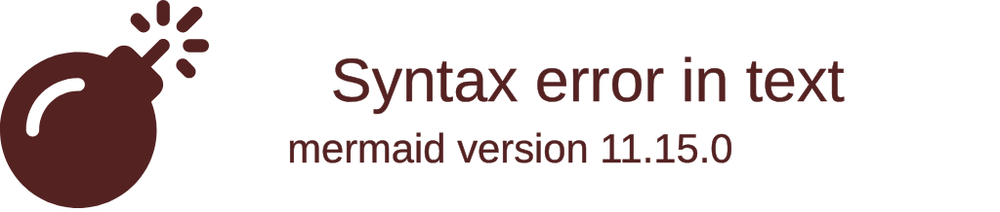

# Diagrama de Componentes

Este diagrama apresenta a visão de alto nível da arquitetura do sistema, englobando a nuvem, APIs, banco de dados gerenciado e a camada de observabilidade (monitoramento).

A arquitetura reflete a divisão em 4 repositórios (Infra Kubernetes, Infra Banco de Dados, Lambda Auth e Aplicação Principal) definidos no escopo do projeto.



*(Obs: Alternativamente, segue abaixo uma visão clássica com o `graph TD` do Mermaid para melhor compatibilidade com algumas ferramentas de visualização.)*

```mermaid
graph TD
    subgraph "Nuvem (AWS / Provedor Genérico)"
        
        Client[Cliente - Front/Mobile] -->|Requisições HTTP| APIGW[API Gateway]
        
        subgraph "Repositório 1: Lambda Serverless"
            APIGW -->|Roteamento /auth| AuthLambda[Função Lambda de Autenticação]
        end
        
        subgraph "Repositório 2 & 4: Infra Kubernetes & API"
            APIGW -->|Roteamento Protegido| Ingress[Ingress Controller K8s]
            Ingress --> PodsAPI[Pods - API Principal C#]
        end
        
        subgraph "Repositório 3: Infra Banco Gerenciado"
            AuthLambda -->|Valida CPF| DB[(PostgreSQL Gerenciado)]
            PodsAPI -->|CRUD de Ordens| DB
        end
        
        subgraph "Monitoramento e Observabilidade"
            PodsAPI -.->|Métricas e Traces (OpenTelemetry)| NewRelic[New Relic APM]
            Ingress -.->|Logs e Traces| NewRelic
            AuthLambda -.->|Logs de Execução| NewRelic
        end
        
    end

    %% Definição de Estilos
    classDef aws fill:#FF9900,stroke:#232F3E,stroke-width:2px,color:black;
    classDef k8s fill:#326ce5,stroke:#fff,stroke-width:2px,color:white;
    classDef db fill:#336791,stroke:#fff,stroke-width:2px,color:white;
    classDef monitor fill:#1CE783,stroke:#000,stroke-width:2px,color:black;

    class AuthLambda,APIGW aws;
    class Ingress,PodsAPI k8s;
    class DB db;
    class NewRelic monitor;
```

## Descrição dos Componentes
- **API Gateway:** Controla o tráfego de entrada e redireciona rotas públicas (`/auth`) para o Lambda e rotas privadas para o Cluster Kubernetes.
- **Função Serverless (Lambda):** Focada exclusivamente em validar o CPF no banco de dados e retornar o token JWT. Garante alta escalabilidade para picos de login sem onerar a aplicação principal. Contém as roles de `admin` e `cliente`.
- **API Principal (Kubernetes):** Aplicação .NET rodando em containers dentro de um cluster K8s (gerenciado via Terraform). Responsável pela regra de negócios de Ordens de Serviço.
- **Banco de Dados Gerenciado (PostgreSQL):** Instância gerenciada separadamente via Terraform, garantindo backup, alta disponibilidade e retenção de dados independentes do cluster Kubernetes.
- **New Relic (OpenTelemetry):** Ferramenta de observabilidade que centraliza a coleta de métricas (Saúde do cluster, Uptime, CPU), logs estruturados e Traces distribuídos das rotas (para medir latência e gargalos).
