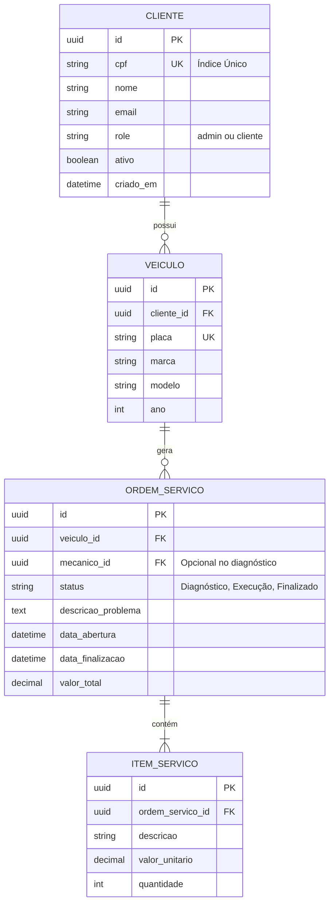

# Diagrama de Entidade-Relacionamento (ER)

Este diagrama detalha a modelagem de dados do sistema principal, focando em garantir a consistência e performance nas operações da Oficina Mecânica.

A estrutura foi otimizada para suportar alta carga de consultas e integrações rápidas com o fluxo de autenticação Serverless (via validação de CPF na tabela `Clientes`).

## Justificativa Formal da Modelagem
1. **Banco de Dados Escolhido:** O **PostgreSQL** foi escolhido devido ao seu forte suporte ao modelo relacional (ACID compliance) que é crítico em um cenário transacional (cobranças, orçamentos, fechamento de ordens de serviço). Ele também suporta tipos nativos de `UUID`, garantindo escalabilidade na geração de IDs entre múltiplos microsserviços.
2. **Índice no CPF:** Um índice `UNIQUE` (UK) foi adicionado à coluna `cpf` na tabela `CLIENTE`. Esta tabela sofrerá leituras maciças pela Lambda de Autenticação. O índice garante a busca do cliente em tempo `O(1)`, melhorando drasticamente a latência do login.
3. **Roles para o JWT:** A coluna `role` no Cliente atende o requisito de separar o usuário *admin default* dos *usuários clientes*. Essa informação será serializada para dentro do Token JWT.
4. **Relacionamento Veículo/OS:** Desacoplar o veículo da OS permite manter o histórico independente de intervenções de um mesmo veículo (para clientes recorrentes).
